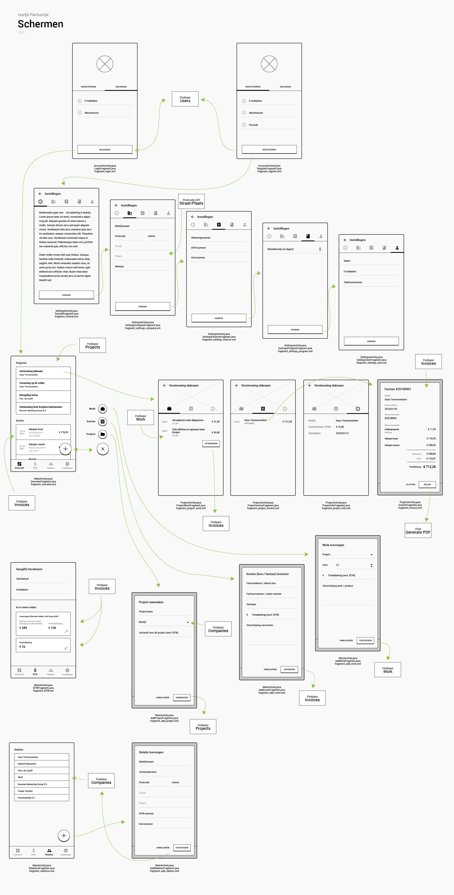

# UurtjeFactuurtje
Android app voor boekhouding van ZZP'ers.

## Design document

### Database structure

**Users**
* ID
  * name
  * e-mail
  * phone
  * payment_days

**Companies**
* ID
  * **user ID**
  * name
  * postal_code
  * street
  * building_nr
  * city
  * bank
  * btw_nr
  * kvk_nr
  * website
  * email
  * person

**Projects**
* ID
  * **user ID**
  * **company ID**
  * name
  * start_date
  * last_invoice
  * hour_price

**Invoices**
* ID
  * **user ID**
  * **project ID**
  * **company ID**
  * sender
  * invoice_nr
  * date
  * subtotal
  * btw
  * total

**Work**
* ID
  * **user ID**
  * **project ID**
  * **invoice ID**
  * date
  * activities
  * hours
  * price
  * paid

**Memorial**
* ID
  * **user ID**
  * bank_balance
  * invoice_nr

### Classes

#### Login / register
| AccountActivity |
| ---- |
| setFragment() |

| LoginFragment |
| ---- |
| logIn() checkAuth() |

| RegisterFragment |
| ---- |
| checkAuth() register() |

#### Main
| MainActivity |
| ---- |
| setFragment() |

#### Overview
| OverviewFragment |
| ---- |
| getProjects() getCosts() showProject() openFloatingMenu() addWork() addCost() addProject() |

| AddProjectFragment |
| ---- |
| getCompanies() addProject() |

| AddCostFragment |
| ---- |
| addCost() |

| AddWorkFragment |
| ---- |
| getProjects() addWork() |

#### BTW
| BTWFragment |
| ---- |
| checkDates() getInvoices() calculateGive() calculateRevenue() calculateGet() |

#### Relaties
| RelationsFragment |
| ---- |
| getRelations() addRelation() |

| AddRelationFragment |
| ---- |
| addRelation() |

#### Project
| ProjectActivity |
| ---- |
| setFragment() navigateBack() |

| ProjectWorkFragment |
| ---- |
| getUnpaidWork() addInvoice() showInvoice() |

| ProjectInvoicesFragment |
| ---- |
| getInvoices() showInvoice() |

| ProjectInfoFragment |
| ---- |
| getProjectInfo() |

| InvoiceFragment |
| ---- |
| getInvoice() |

#### Settings
| SettingsActivity |
| ---- |
| setFragment() |

| TutorialFragment |
| ---- |
| launchNextTab() |

| SettingsCompanyFragment |
| ---- |
| getAddress() setCompanySettings() launchNextTab() |

| SettingsFinanceFragment |
| ---- |
| setFinanceSettings() launchNextTab() |

| SettingsProgramFragment |
| ---- |
| setProgramSettings() launchNextTab() |

| SettingsUserFragment |
| ---- |
| setUserSettings() launchNextTab() |

### External components / libraries
* Firebase (https://firebase.google.com/)
* iText PDF generator (https://github.com/itext)

### API's
* Postcode API (https://www.postcodeapi.nu/)

### Screens and flow chart
