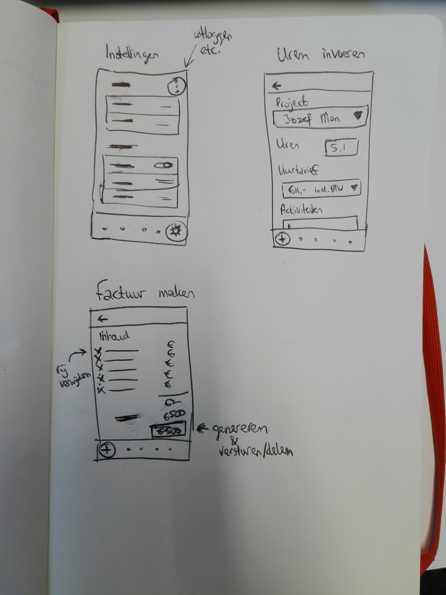

# UurtjeFactuurtje
Android app voor boekhouding van ZZP'ers.

## Author
Een Android App project van [Lennart Klein](http://www.lennartklein.nl), in opdracht van de Universiteit van Amsterdam.

## Project Proposal

### Problem statement
Nederland telt ruim 1 miljoen zelfstandigen zonder personeel (zzp’ers) en dat worden er steeds meer. 1 De werkzaamheden van deze groep lopen uiteen evenals de administratieve vaardigheden. Het bijhouden van een boekhouding is dan al snel ingewikkeld, moet worden ingelezen en belemmert het werken. De app's en diensten die momenteel op de markt zijn gaan uit van een bepaalde basiskennis die niet bij elke ZZP'er aanwezig is. 234
1 CBS, "Dossier ZZP". https://www.cbs.nl/nl-nl/dossier/dossier-zzp
2 Thinq, "Boekhouding App". https://www.thinq.nl/hoe-werkt-het/boekhouding-app
3 Offective, "Online Boekhouden". https://www.offective.nl/online-administratie-software/online-boekhouden
4 Informer, "Boekhoudprogramma". https://www.informer.nl/

### Solution
De oplossing is een enorm simpele app met een moderne vormgeving die boekhouding beperkt tot een simpel kassa-systeem. De ZZP'er hoeft slechts in te voeren en het systeem doet het denkwerk. Het houdt de ondernemer op de hoogte wanneer belasting moet worden aangegeven en welke velden daarvoor moeten worden ingevuld. De ZZP'er hoeft nu alleen nog verstand te hebben van zijn eigen werk.

#### Requirements
De onderstaande requirements voor de app zijn volgens de MoSCoW-methode opgedeeld.
De requirements zijn zo opgesteld, dat in de 4 weken van dit project in ieder geval de 'must have' en eventueel 'should have' gemaakt kunnen worden. De rest van de requirements zijn todo's voor de toekomst.

##### Must have
* App moet te gebruiken zijn op smartphone & tablet
* Inloggen / registreren (via Firebase)
* Bedrijfsgegevens invoeren (gekoppeld aan Firebase-account)
* Uurprijzen invoeren (gekoppeld aan Firebase-account)
* Projecten aanmaken
* Projectdetails invoeren
* Gemaakte uren + uurtarief + beschrijving van activiteiten toevoegen aan project
* Gemaakte kosten toevoegen aan project
* Factuur voor een project genereren
* Bedrijfskosten invoeren (m.b.v. boekstuknummer ook fysiek te bewaren)
* Voor BTW-aangifte komt een output van boekhouding met juiste info

##### Should have
* Invoeren van betalingen (inkomsten en uitgaven op bankrekening)
* Overzicht van inkomsten, uitgaven, kosten, winst
* Contactgegevens bij project toevoegen
* Project afsluiten

##### Could have
* Verkoopbare producten invoeren en aantallen bijhouden
* Verkochte producten toevoegen aan project
* Notificatie wanneer BTW-aangifte moet geschieden
* Bijhouden van afspraken via Google Calendar implementatie
* 'Hulp-scherm' met uitleg over begrippen in de app & hoe boekhouding voor ZZP'ers werkt
* Berekening voor 'Kleine ondernemersregeling'

##### Nice to have
* Live timer tijdens het werken aan project
* Foto van bonnen / facturen toevoegen
* PDF van bonnen / facturen toevoegen
* Backup van gehele boekhouding maken en naar e-mail versturen
* Verschillende uurprijzen per project
* Bepaalde features (timer, uren invoeren) van de app ook beschikbaar voor Android Wear
* Periodieke kosten (wekelijks, maandelijks, jaarlijks) worden automatisch verwerkt
* Vaste Activa & afschrijving daarvan bijhouden

#### Sketches

#### Hardest parts
Het koppelen van gemaakte uren aan een project, de datum daarvan onthouden en op basis daarvan een factuur genereren. Het maken van die factuur is op zichzelf ook nog een uitdaging. Er moet namelijk een PDF op A4-formaat worden gegenereerd, welke wordt opgeslagen en per mail moet worden verstuurd.

De grootste uitdaging opgesomd: databeheer (opslaan van grotere files), datums vergelijken, data koppelen aan andere data en bovenal: begrijpelijke en eenvoudige interface.

#### External components / data sources
* Firebase (https://firebase.google.com/)
* iText PDF generator (https://github.com/itext)
* Postcode API (https://www.postcodeapi.nu/)
* Google Calendar API (https://developers.google.com/google-apps/calendar/)

### Similar apps
#### E-boekhouden
https://play.google.com/store/apps/details?id=eboekhouden.nl&hl=nl

##### Good
* Veilige inlogmethodes: pincode, fingerprint
* Overzicht van winst en verlies per maand
* Openstaande betalingen direct inzichtelijk

##### Bad
* Onnatuurlijke interface
* Weinig inzicht in de features voor nieuwe gebruikers
* Veel in te stellen als ondernemer

#### InformerOnline
https://play.google.com/store/apps/details?id=nl.Informer.app

##### Good
* Duidelijk startscherm met grote buttons
* Informatie invoeren duidelijk met imagebuttons

##### Bad
* Design niet duidelijk. Logo van de app blijft onnodig in beeld.
* App is slechts te gebruiken voor invoeren van gegevens. Niet voor gegevens eruit lezen (bijv. BTW of debiteuren / crediteuren)